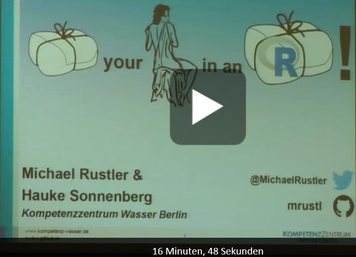

# useR-2016

[Slides](https://github.com/mrustl/useR-2016/blob/master/WrapYourModel.pdf) for the "Wrap your model in an R package" talk @ useR2016

# Challenges
Environmental models are: 
- (Usually) not implemented in R 
- Generic: i.e. the model parameterisations need to be defined for each case-study (**at least one model run**),
possibly followed by a sensitivity analysis (**multiple model runs**) to identify the model parameters with the 
highest impact on the model predictions. Finally a model calibration step (**multiple model runs**) for minimising
the error between measured and predicted model output is performed by varying the most sensitive input parameters 
(which cannot be determined precisely enough through measurements) within a realistic range. 

**Rule-of-thumb:**
"If you’re going to do something **three times or more**, you should think about writing a **small package**"([Roger D. Peng, 2016](http://simplystatistics.org/2016/05/18/software-engineering-data-science/))

# “Wrapped“ models 

[WTAQ-2 (USGS)](http://water.usgs.gov/ogw/wtaq)
- R package: https://github.com/KWB-R/kwb.wtaq 
- Tutorial: https://kwb-r.github.io/kwb.wtaq 

In addition we also "wrapped" the following models (but these are not yet available on Github):
- [EPANET (USEPA)](https://www.epa.gov/water-research/epanet) 
- [VS2DI (USGS)](http://wwwbrr.cr.usgs.gov/projects/GW_Unsat/vs2di1.3/) 

# More details on "wrapping" concept:

Check out our conference paper ["Wrap your model!" (Sonnenberg et al. 2014)](http://doi.org/10.13140/RG.2.1.2140.3683)

